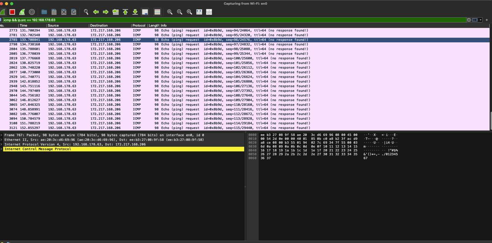

## ARP attack implementation status

- We now have the “poisoning” leg built: `tool/arp_lab.py` picks an interface, resolves each target’s MAC, and keeps sending forged ARP replies so both victims believe the attacker owns the other IP.
- The demo is intentionally simple—no packet forwarding/traffic relay yet—so you can watch the ARP lies land without other moving parts.
- Try it with `python -m tool.cli arp-demo` after plugging in your two target IPs (either in the runner or by adding args to the CLI).
- Wireshark showing packets coming from victim: 